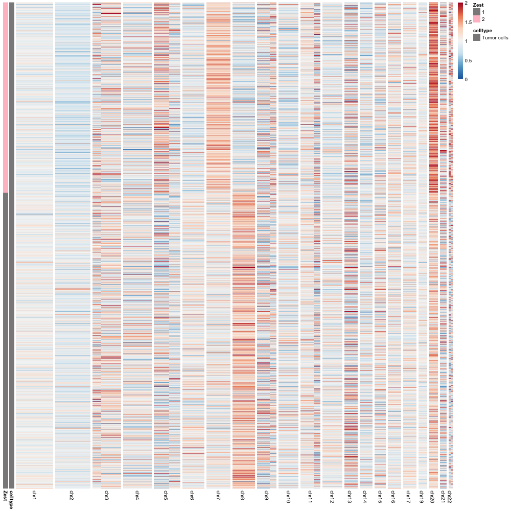
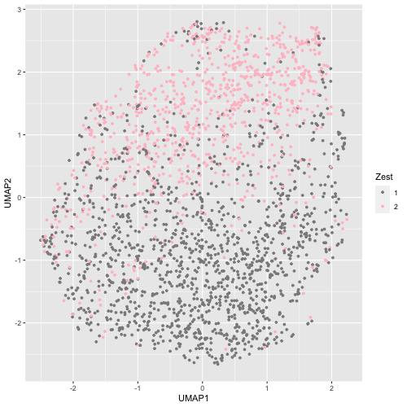

Clonalscope (scRNA-seq without Paired WGS) on Sample P5847
================
Chi-Yun Wu, Jiazhen Rong, Zhang Lab, University of Pennsylvania

## Description
For scRNA-seq data, Clonalscope enables subclone detection and malignant cell labeling.
This tutorial is for the case when paried WGS is not avalible.

For more information about the method, please check out the [github](https://github.com/seasoncloud/Clonalscope) and the [manuscript](https://doi.org/10.1101/2022.07.05.498882).
<br/>

## Prepare input files
The following are the input files for different steps.

1. A feature-barcode (sparse) UMI matrix. [EXAMPLE](https://github.com/seasoncloud/Clonalscope/blob/main/data-raw/P5931/scRNA/filtered_feature_bc_matrix/matrix.mtx.gz) 
* The matrix is the standard output of the Cell Ranger software.
* Each element is the number of UMIs associated with a feature (row) and a barcode (column).
<br/>
 
2. A tsv file for all cell barcodes. [EXAMPLE](https://github.com/seasoncloud/Clonalscope/blob/main/data-raw/P5931/scRNA/filtered_feature_bc_matrix/barcodes.tsv.gz)
* The "barcodes.tsv" file is the standard output of the Cell Ranger software.
* Each row is a barcode indicating cell identity.
<br/>
 
3. A tsv file for feature information. 
[EXAMPLE](https://github.com/seasoncloud/Clonalscope/blob/main/data-raw/P5931/scRNA/filtered_feature_bc_matrix/features.tsv.gz)
* The "features.tsv" file is the standard output of the Cell Ranger software.
* Each row is a gene.The first two columns need to be gene ID and gene name.
<br/>

4. A matrix for cell type annotation. 
[EXAMPLE](https://github.com/seasoncloud/Clonalscope/blob/main/data-raw/P5931/scRNA/celltype_all.rds)
* Each row is a cell. The first and second columns are "cell barcodes" and "annotated cell types". 
* This matrix is used to specify the cells to use as the baseline for coverage normalization. Please specify the set of cells to be used as the baseline as "normal". 
* This celltype annotation file can be generated from standard scRNA-Seq analysis and cells can be annotated based on their marker genes (or by RCTD for spatial transcriptomics). We recommend choosing known normal celltypesas "normal", such as immune cells.
<br/>

5. Segments without Paired WGS/WES

In this tutorial, we will show how to generate CNV segments when paired WGS/WES is not avalible.
* Without matched tumor and normal WGS/WES data, chromosome arms can be used as the segments.
* We further capture segments with finer resolutions by utilizing the cluster-level segments generated from chromosom arms.
<br/>

## Tutorial for scRNA-seq data
* Here is an example application of Clonalscope on no paired WGS data to the P5931 scRNA-seq dataset from Sathe et al., 2020.
* Running time: ~60 minutes. 
* To speed up the process, users could also load our resulted objects in this tutorial, including **Cov_obj.rds** in Step 1, **bin_mtx.rds** in Step 2 and **seg_filtered_from_cluster.rds** from Step 2.
<br/>

#### Step 0. Load the input files

* In R, set up the environment and read common files.
```
library(Clonalscope) # load the library
setwd("~/Clonalscope/") # set path to the github folder

dir_path <- "./samples/P5847/scRNA/noWGS_output/"; dir.create(dir_path) # set up output directory

# Size of each chromosome (hg19 and GRCh38 are provided.)
size <- read.table("data-raw/sizes.cellranger-GRCh38-1.0.0.txt", stringsAsFactors = F)

# List of cyclegenes retrieved from the "CopyKAT"package (https://github.com/navinlabcode/copykat)
cyclegenes <- readRDS("data-raw/cyclegenes.rds")

# bed file indicating gene positions (hg19 and GRCh38 are provided.)
bed <- read.table("data-raw/hg38.genes.bed", sep='\t', header = T)

```

* Read example data files
```
# files for scRNA-seq data
mtx <- readMM("data-raw/P5847/scRNA/filtered_feature_bc_matrix/matrix.mtx.gz")
barcodes <- read.table("data-raw/P5847/scRNA/filtered_feature_bc_matrix/barcodes.tsv.gz", stringsAsFactors = F, sep='\t', header=F)
features <- read.table("data-raw/P5847/scRNA/filtered_feature_bc_matrix/features.tsv.gz", stringsAsFactors = F, sep='\t', header=F)
celltype0 <- readRDS("data-raw/P5847/scRNA/P5847t_celltype_20220206.rds") # load celltype annotation from Seurat gene expression analysis
```
<br/>

#### Step 1. First Round Clonalscope Estimation using chromosomal arms.
* Create segmentation based on chromosomal arms for the first round estimation.
```
# no WGS, using chromosomal arms
# Generate segmentation table for each chromosome arm.
chrarm <- read.table("data-raw/cytoarm_table_hg38.txt", stringsAsFactors = F, sep='\t', header=T)
chrarm <- chrarm[order(as.numeric(chrarm[,1]),as.numeric(chrarm[,3])),]
bin_bed <- chrarm[,-2]
seg_table_filtered <- data.frame("chr"=bin_bed[,1], 'start'=as.numeric(bin_bed[,2]),
                                 'end'=as.numeric(bin_bed[,3]), 'states'=1, 'length'=as.numeric(bin_bed[,3])-as.numeric(bin_bed[,2]),
                                 'mean'=0, 'var'=0, 'Var1'=1:nrow(bin_bed),'Freq'=50000,
                                 'chrr'=paste0(bin_bed[,1],":", bin_bed[,2]), stringsAsFactors = F)
```
* Then, estimate the CNV profile and detects the subclones based on the chromosomal arm level segment table.
```
# setting normal/reference cells in the annotation file
celltype <- celltype0
celltype[which(!grepl("Tumor",celltype[,2])),2]='normal' # setting normal cell reference

# Select barcodes for clustering only on epithelial/tumor cells
clustering_barcodes <- celltype[which(grepl("Epithelial",celltype[,2])),1]

# Filtering HLA and cell cycle genes
Input_filtered <- FilterFeatures(mtx=mtx, barcodes=barcodes, features=features, cyclegenes=cyclegenes)

# Remove raw inputs
rm(mtx); rm(barcodes); rm(features)

Cov_obj <- RunCovCluster(mtx=Input_filtered$mtx, barcodes=Input_filtered$barcodes,
                         features=Input_filtered$features, bed=bed,
                         celltype0=celltype, var_pt=0.99, var_pt_ctrl=0.99, include='all',
                         alpha_source='all', ctrl_region=NULL,
                         seg_table_filtered=seg_table_filtered, size=size,
                         dir_path=dir_path, breaks=50, prep_mode = 'intersect', est_cap = 2,
                         clust_mode='all',clustering_barcodes=clustering_barcodes,mincell=50)
saveRDS(Cov_obj,paste0(dir_path,"Cov_obj_chrarm.rds"))
```
Users could stop at Step 1 and directly go to Step 4 for visualization with **Cov_obj** object, which contains DNA segments at chromosomal arms level. If user is interested in checking segments with refined resolution, we provide a second round estimation by creating new segments from different CNV clusters' segment breakpoints in Step 2 and Step 3.
<br/><br/>

#### Step 2. Identify segments with finer resolution from 1st round estimation of Clonalscope.
If user would like to identify smaller CNV segments, we could utilize cluster-level segments from 1st round estimation.

* Re-load Clonalscope 1st round results.
```
Cov_obj <- readRDS(paste0(dir_path,"Cov_obj_chrarm.rds"))
clustering= Cov_obj$result_final$clustering
clustering2= Cov_obj$result_final$clustering2
result = Cov_obj$result_final$result
Zest=Cov_obj$result_final$result$Zest
```
  * (Optional)The **mincell** parameter (default value set as 1% of all clustering cells) could be tuned to assign clusters until all clusters' cell size become larger than mincells. We suggest tuning this parameter based on the dataset. If **mincell** is too small, the corresponding fragments might be too fragmented and being filtered out in later analysis. 
```
# Reassign clusters based on mincell number (optional)
result=AssignCluster(clustering2, mincell = 50) 
Zest=result$Zest
```
* Create the new segments by:
  * Generate bin x cell counts given the bin_bed files (e.g. 200k bp bins).
  * Calculate cluster-level binned counts as WGS/WES data and running HMM segmentation on cluster based counts.
  * Create smaller CNV segments by keeping breakpoints from all HMM results.
  * Merge segments if nearby segments have same CNV states appearing from HMM.
  
```
# load 200k bp bins for each cell
bin_bed=read.table("data-raw/hg38_200kb.windows.bed")
# only keep autosomes (chr 1- 22)
bin_bed=bin_bed[bin_bed[,1] %in% paste0("chr",c(1:22)),]
seg_filtered <- CreateSegtableNoWGS(mtx = Input_filtered$mtx, barcodes = Input_filtered$barcodes, features=Input_filtered$features, 
                                   Cov_obj=Cov_obj, Zest=Zest,
                                   bin_bed=bin_bed, celltype0=celltype,dir_path=dir_path,
                                   bin_mtx=NULL, # estimating bin x cell count matrix
                                   plot_seg = TRUE, hmm_states = c(0.5, 1.5, 2), max_qt = 0.95, nmean=500, rm_extreme = 2, adj=-0.5# HMM parameters that can be adjusted by users
                                   )
```
* (Optional) Based on the generated HMM segmentation plots, users could also adjust the HMM related parameters. 
  The calculation could be speed up by loading the bin by cell matrix that was already calculated:
```
bin_mtx <- readRDS(paste0(dir_path,"bin_mtx.rds")) # if already generated this matrix by running "SecondRoundNoWGS".
seg_filtered <- CreateSegtableNoWGS(mtx = Input_filtered$mtx, barcodes = Input_filtered$barcodes, features=Input_filtered$features, 
                                    Cov_obj=Cov_obj, Zest=Zest, gtf=gtf,
                                    bin_bed=bin_bed, celltype0=celltype,dir_path=dir_path,
                                    bin_mtx=bin_mtx, # load already estimated bin x cell count matrix
                                    plot_seg = TRUE, hmm_states = c(0.5, 1.5, 2), max_qt = 0.95, nmean=500, rm_extreme = 2, adj=-0.5# HMM parameters that can be adjusted by users
)
```
<br/><br/>

#### Step 3. Running Clonalscope again with the new segments
With the new and finer segments created from Step 2, we could run Clonalscope again to obtain better subclone detection based on the segments.
```
# re-load refine segments from step2:
seg_filtered <- readRDS(paste0(dir_path,"seg_filtered_from_cluster.rds" ))
# second round estimation with new segments
clustering_barcodes <- celltype0[which(grepl("Tumor",celltype[,2])),1]  # only clustering on Tumor cells
second_seg_table <- data.frame("chr"=seg_filtered[,1], 'start'=as.numeric(seg_filtered[,2]),
                               'end'=as.numeric(seg_filtered[,3]), 'states'=1, 'length'=as.numeric(seg_filtered[,3])-as.numeric(seg_filtered[,2]),
                               'mean'=0, 'var'=0, 'Var1'=1:nrow(seg_filtered),'Freq'=50000,
                               'chrr'=paste0(seg_filtered[,1],":", seg_filtered[,2]), stringsAsFactors = F)
                               
# Wrapper function of Clonalscope
set.seed(2023)
Cov_obj2 <- RunCovCluster(mtx=Input_filtered$mtx, barcodes=Input_filtered$barcodes, 
                          features=Input_filtered$features, bed=bed, 
                          celltype0=celltype, var_pt=0.99, var_pt_ctrl=0.99, include='all',
                          alpha_source='all', ctrl_region=NULL, 
                          seg_table_filtered=second_seg_table, size=size,
                          dir_path=dir_path, breaks=50, prep_mode = 'intersect', est_cap = 2,
                          clust_mode='all',clustering_barcodes=clustering_barcodes,mincell = 50) 

saveRDS(Cov_obj2,paste0(dir_path,"/Cov_obj_second.rds"))
```

#### Step 4. Visualization
Now we can visualize the new Clonalscope results with refined segments.
* Extract clustering results from the object.
```
clustering <- Cov_obj$result_final$clustering
clustering2 <- Cov_obj$result_final$clustering2
result <- Cov_obj$result_final$result
table(result$Zest)
df= clustering$data
celltype2=celltype[match(rownames(df), celltype[,1]),]
```
* Visualize the subclones/clusters in the heatmap.
```
# plot each segment with equal length
PlotClusters(df= clustering$data,celltype = celltype2, Assign_obj = result, mode = "segment", lab_mode = "annot")
# Or, plot each segment based on the actual genomic length
PlotClusters(df= clustering$data,celltype = celltype2, Assign_obj = result, mode = "genome", lab_mode="annot")
```



* Visuzlize the subclones/clusters in the UMAP.
```
# Plot the UMAP and save the coordinates
set.seed(2023)
## UMAP
emb <- PlotUMAP(df = Cov_obj$result_final$df_obj$df, 
                celltype = celltype2, 
                Assign_obj =result, mode = "Zest")
```


<br/><br/>


