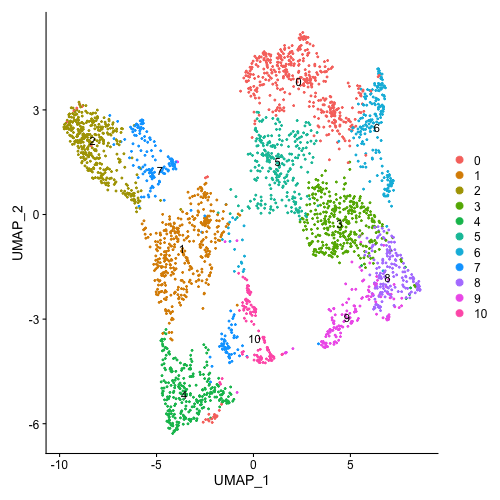
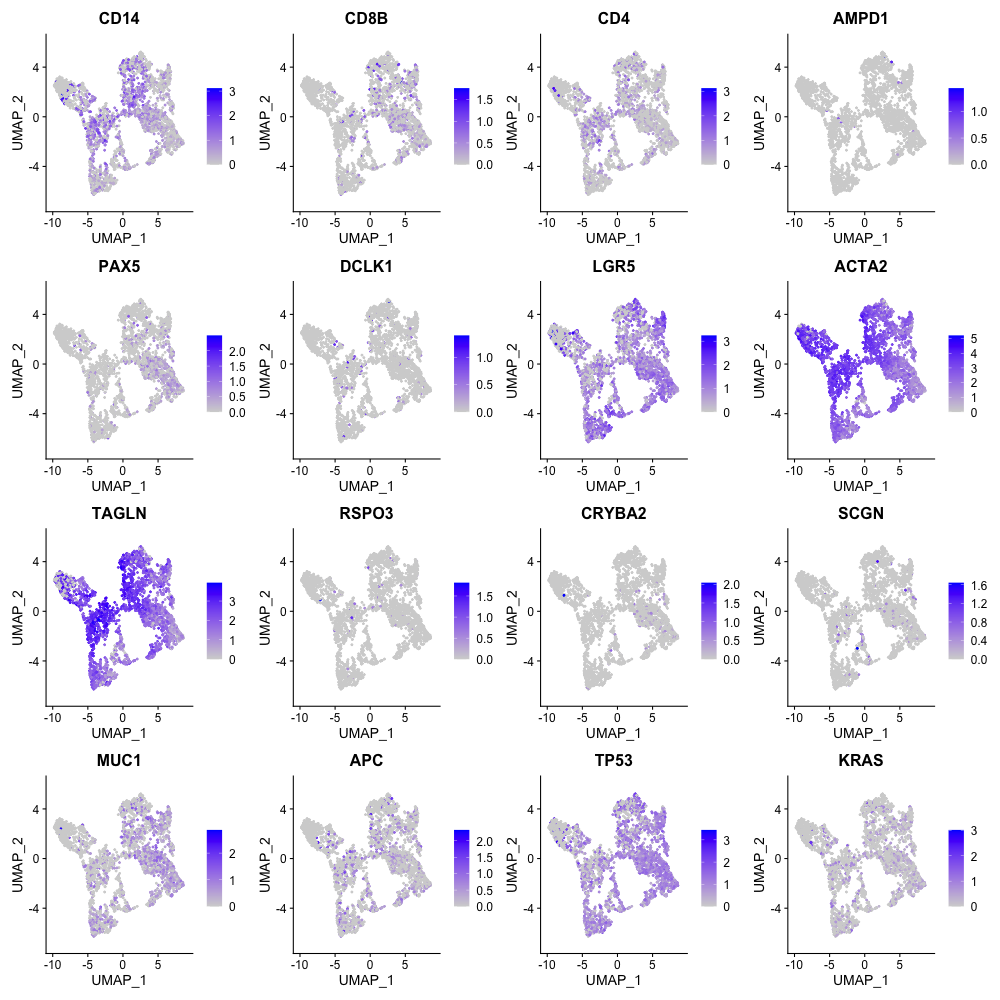
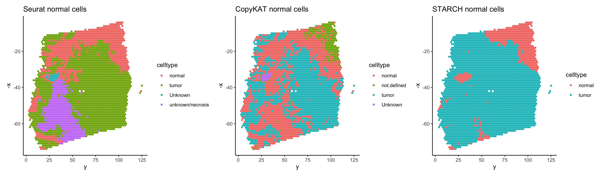

## (Without Paired DNA) Selecting normal cells/spots and only clustering on tumor cells/spots

Jiazhen Rong, Chi-Yun Wu, Zhang Lab, University of Pennsylvania

2024-01-14

### Introduction

In Clonalscope, we identify tumor from normal cells by comparing the CNA profiles to that of the matched DNA-seq data. Yet, when the paired DNA data is not available, the tumor/normal cells could still be identified through marker genes, or by methods as in previously published tools [1-3]. After identifying the tumor cells, we also provide a mode to only cluster on the tumor cells by specifying **clustering_barcodes** parameter in the function.

In this tutorial, we will use a spatial transcriptomics colorecral carcinoma dataset generated by our study (10x Genomics chemistry, will be avaliable upon publication), to demonstrate how to (1) identify tumor/normal cells first, then (2) cluster on tumor cells only, and (3) lastly visualize the clones with spatial coordinates.

### Load Data

```{r,echo=T,eval=F}
# load example data from standard 10x genomics format} 
mtx <- readMM("data/V11Y04-378-A1/filtered_feature_bc_matrix/matrix.mtx.gz") 
barcodes <- read.table("data/V11Y04-378-A1/filtered_feature_bc_matrix/barcodes.tsv.gz", stringsAsFactors = F, sep='\t', header=F) 
features <- read.table("data/V11Y04-378-A1/filtered_feature_bc_matrix/features.tsv.gz", stringsAsFactors = F, sep='\t', header=F) 
colnames(mtx) <- barcodes[,1]
rownames(mtx) <- features[,1]
# load spatial spot_datainates
spot_data = as.data.frame(read.table("data/V11Y04-378-A1/spatial/tissue_positions_list.csv",sep=","))
colnames(spot_data) <-c("barcode","include","row","col","image_row","image_col")
rownames(spot_data) <- spot_data[,1]
```

### Identifying normal cells

Here, we introduce several ways to identify tumor versus normal cells when paired DNA data is not available.

-   **Setting the tumor and normal cells/spots based on the marker genes.**

    If the tumor/normal marker genes are known, a standard and separate Seurat analysis could be applied on the transcirptomics to identify normal versus tumor cells/spots. An example is shown below.

    ```{r seurat, echo=T,eval=F}
    library(dplyr)
    library(Seurat)
    library(patchwork)

    output_path = "your_specified_output_path/"
    # create seurat object
    seurat_obj <- CreateSeuratObject(counts = counts, project = "tutorial_normal", min.cells = 3, min.features = 200,)
    # pre-processing
    seurat_obj <- NormalizeData(seurat_obj, normalization.method = "LogNormalize", scale.factor = 10000)
    seurat_obj <- FindVariableFeatures(seurat_obj, selection.method = "vst", nfeatures = 2000)
    all.genes <- rownames(seurat_obj)
    seurat_obj <- ScaleData(seurat_obj, features = all.genes)
    # linear reduction
    seurat_obj <- RunPCA(seurat_obj, features = VariableFeatures(object = seurat_obj))
    seurat_obj <- FindNeighbors(seurat_obj, dims = 1:15)
    seurat_obj <- FindClusters(seurat_obj, resolution = 0.5)
    # UMAP
    seurat_obj <- RunUMAP(seurat_obj, dims = 1:15)
    saveRDS(seurat_obj, file = paste0(output_path,"/seurat_obj.rds"))

    # Find DEGs/markers of each cluster
    seurat_obj.markers <- FindAllMarkers(seurat_obj, only.pos = TRUE, min.pct = 0.25, logfc.threshold = 0.25)
    write.table(seurat_obj.markers,paste0(output_path,"/AllMarkers.txt"),sep="\t",row.names = F)
    ```

    For primary colorectal cancer, marker genes of tumor cells like TP53, APC and KRAS are known from previous studies. Marker genes of other known celltypes could be further defined by professional knowledge. Additional evidences like H&E images could also be utilized to annotate the clusters with tumor origin.

    ```{r seurat_visualize, echo=T,eval=F}
    p1 <- DimPlot(seurat_obj)
    p2 <- FeaturePlot(seurat_obj, features = c("CD14",# monocytes
                               "CD8B","CD4",# T cells
                               "AMPD1", # plasma cells
                               "PAX5", # B cells
                               "DCLK1","LGR5", # stem-like cells,
                               #"RAB6B", # enterocytes
                               #"CA1",
                               #"WNT2B","WNT5B",
                               "ACTA2","TAGLN","RSPO3","CRYBA2","SCGN", # fibroblast
                               "MUC1", # epithelial
                               "APC","TP53","KRAS" # colon cancer marker gene
                               ))
    p1+p2
    ```

    

    

    For the downstream Clonalscope clustering, please specifically annotate the tumor cells that the clustering would be performed on as **"tumor"**. The clusters that users would like to be used as control for CNV estimation should be annoated as **"normal"**.

    ```{r seurat_visualize2, echo=T,eval=F}
    new.cluster.ids <- c("unknown/necrosis", "normal-immune", "normal-stromal", #0,1,2
                     "tumor", "tumor", "tumor", #3,4,5 - based on TP53
                     "tumor", "tumor", "tumor", #6,7,8 - based on TP53
                     "tumor","tumor") # 9,10 - based on TP53
    # setting immune cell cluster as normal
    names(new.cluster.ids) <- levels(seurat_obj)
    seurat_obj <- RenameIdents(seurat_obj, new.cluster.ids)
    celltype <- cbind(names(seurat_obj@active.ident),as.character(seurat_obj@active.ident))
    celltype[celltype[,2] %in% c("normal-immune", "normal-stromal"),2] = "normal" 
    saveRDS(celltype,paste0(output_path,"/celltype_seurat_TumorNormal.rds"))
    ```

-   **Identify normal cells via the method of CopyKAT**

    [CopyKAT](https://www.nature.com/articles/s41587-020-00795-2) identifies normal cells by hierarchically clustering the scRNA data into 6 clusters, fitting GMM model on the variance of the consensus genes and identifying the cluster with smallest variance and that also passes Fisher's F test on $F=\frac{\sigma_{max}^2}{\sigma_{min}^2}$. The step 1-4 of CopyKAT could be used to provide a quick estimation of tumor/normal cells/spots, by running ***copykat_normal*** function. However, this step might be biased and the full version of copykat will make adjustment in the end.

    1.  Looking for the cluster with smallest variance of consensus genes (quick method):

    ```{r copykat, echo=T,eval=F}
    library(copykat)
    source("identify_normal_cells_noWGS.R")
    # getting normal barcodes predicted from copykat step 1-4
    copykat_pred_N <- copykat_normal(mtx,force_WNS=T)
    celltype = cbind(barcodes=colnames(mtx),annotation="Unknown")
    celltype[celltype[,1] %in% names(copykat_pred_N),2] = "normal"
    saveRDS(celltype,paste0(output_path,"celltype_copykat_TN_quick.rds"))
    ```

    2.  Or, using stringent criteria from copykat, which will take more time if GMM does not convergent:

    ```{r copykat_gmm_iterative, echo=T,eval=F}
    library(copykat)
    source(paste0(output_path,"identify_normal_cells_noWGS.R"))
    # getting normal barcodes predicted from copykat step 1-4
    copykat_pred_N <- copykat_normal(mtx)
    celltype = cbind(barcodes=colnames(mtx),annotation="Unknown")
    celltype[celltype[,1] %in% names(copykat_pred_N),2] = "normal"
    saveRDS(celltype,paste0(output_path,"celltype_copykat_TN_stringent.rds"))
    ```

    3.  (Recommended compare to partial steps) Or, the full version of copykat could be run to get a better prediction of tumor versus normal cells. The running time will be longer. To align copykat's identified anueploid versus diploid cells with Clonalscope downstream results:

    ```{r copykat_full, echo=T,eval=F}
    library(copykat)
    # load copykat refined predictions after running the full version
    copykat_result = read.table("results/CopyKAT/SeuratNormal/V11Y04-378-A1/test_copykat_prediction.txt",header=T)
    celltype=copykat_result
    celltype[celltype[,2] == "aneuploid",2] = "tumor"
    celltype[celltype[,2] == "diploid",2] = "normal"
    saveRDS(celltype,paste0(output_path,"celltype_copykat_full.rds"))
    ```

-   **Identify normal cells via the method of STARCH:**

    Alternatively, [STARCH](https://pubmed.ncbi.nlm.nih.gov/33022659/) provides a quick identification of normal spots via (1) taking the first principal component of PCA of the data and (2) performs Kmeans clustering with K=2 on the first component of PCA. The clusters with lower gene expression is assigned as normal spots.

-   We implemented the R equivalent method for a quick idenfitication of normal/tumor spots by calling ***starch_normal*** function**.**

    ```{r starch, echo=T,eval=F}
    normal_spots = starch_normal(mtx)
    celltype=cbind(barcodes,
                   annotation="tumor")
    celltype[celltype[,1] %in% normal_spots,2] = "normal"
    saveRDS(celltype,paste0(output_path,"celltype_starch.rds"))
    ```

    Let's take a look at the normal cells identified in space. Users could choose the normal celltype that align with the known evidences.

    ```{r normal_compare, echo=T,eval=F}
    # load and plot the normal cells
    celltype_seurat=readRDS(paste0(output_path,"celltype_seurat_TumorNormal.rds"))
    g1<- SpatialPlot(spot_data,celltype_seurat,save=T,output_path,title="Seurat normal cells")
    celltype_copykat=readRDS(paste0(output_path,"celltype_copykat_full.rds"))
    g2<- SpatialPlot_Normal(spot_data,celltype_copykat,save=T,output_path,title="CopyKAT normal cells")
    celltype_starch=readRDS(paste0(output_path,"celltype_starch.rds"))
    g3<- SpatialPlot(spot_data,celltype_starch,save=T,output_path,title="STARCH normal cells")
    g1+g2+g3
    ```



-   **Other potential methods**

    Other CNV inference tools like [InferCNV](https://github.com/broadinstitute/infercnv) could be used to get an initial estimation of CNV segments and decide which clusters are normal based on manual inspection of the CNV profile. The output from Clonalscope itself could also be used to inspect the CNV profile and manually assign the identified clusters as tumor/normal.

### Clustering only on the identified tumor cells

Now we can run the subclone detection with Clonalscope as in our new [*Tutorial 4 - Clonalscope (scRNA-seq without Paired WGS) on Sample P5847*](https://github.com/seasoncloud/Clonalscope/tree/no_pairedWGS_branch/samples/P5847/scRNA) since v1.1.0. By specifying the **clustering_barcodes** parameter, Clonalscope can cluster on specificed cell/spot barcodes. Here we show an example with the initial estimation with chromosomal arm level segments.

```{r clonalscope_clustering,echo=T,eval=F}
library(Clonalscope) # load the library
setwd("~/Clonalscope/") # set path to the github folder

dir_path <- output_path; dir.create(dir_path) # set up output directory

# Size of each chromosome (hg19 and GRCh38 are provided.)
size <- read.table("data-raw/sizes.cellranger-GRCh38-1.0.0.txt", stringsAsFactors = F)
# List of cyclegenes retrieved from the "CopyKAT"package (https://github.com/navinlabcode/copykat)
cyclegenes <- readRDS("data-raw/cyclegenes.rds")
# bed file indicating gene positions (hg19 and GRCh38 are provided.)
bed <- read.table("data-raw/hg38.genes.bed", sep='\t', header = T)

# no WGS, using chromosomal arms
# Generate segmentation table for each chromosome arm.
chrarm <- read.table("data-raw/cytoarm_table_hg38.txt", stringsAsFactors = F, sep='\t', header=T)
chrarm <- chrarm[order(as.numeric(chrarm[,1]),as.numeric(chrarm[,3])),]
bin_bed <- chrarm[,-2]
seg_table_filtered <- data.frame("chr"=bin_bed[,1], 'start'=as.numeric(bin_bed[,2]),
                               'end'=as.numeric(bin_bed[,3]), 'states'=1, 'length'=as.numeric(bin_bed[,3])-as.numeric(bin_bed[,2]),
                               'mean'=0, 'var'=0, 'Var1'=1:nrow(bin_bed),'Freq'=50000,
                               'chrr'=paste0(bin_bed[,1],":", bin_bed[,2]), stringsAsFactors = F)

```

To only clustering on tumor cells, the **clustering_barcodes** parameter should be specified as the barcodes that are identified tumor (or non-normal) cells/spots. Here we utilize the seurat annotation and want to cluster on non-normal spots:

```{r clonalscope_clustering2,echo=T,eval=F}
# setting normal/reference cells in the annotation file
celltype <- celltype_seurat

# Select barcodes for clustering only on epithelial/tumor cells
clustering_barcodes <- celltype[which(!grepl("normal",celltype[,2])),1]

# Filtering HLA and cell cycle genes
Input_filtered <- FilterFeatures(mtx=mtx, barcodes=barcodes, features=features, cyclegenes=cyclegenes)

# Remove raw inputs
rm(mtx); rm(barcodes); rm(features)

Cov_obj <- RunCovCluster(mtx=Input_filtered$mtx, barcodes=Input_filtered$barcodes,
                         features=Input_filtered$features, bed=bed,
                         celltype0=celltype, var_pt=0.99, var_pt_ctrl=0.99, include='all',
                         alpha_source='all', ctrl_region=NULL,
                         seg_table_filtered=seg_table_filtered, size=size,
                         dir_path=dir_path, breaks=50, prep_mode = 'intersect', est_cap = 2,
                         clust_mode='all',clustering_barcodes=clustering_barcodes)
saveRDS(Cov_obj,paste0(dir_path,"Cov_obj_chrarm.rds"))
```

We can visualize the clustering result that's only on tumor spots in space:

```{r clonalscope_cluster_vis, echo=T,eval=F}
clusters_clonalscope = cbind(names(Cov_obj$result_final$result$Zest),
                             Cov_obj$result_final$result$Zest)

SpatialPlot(spot_data,clusters_clonalscope,save=T,output_path,title="Clonalscope Clustering Only on Tumor Spots",cluster=T,pt_size=3)
```


### Reference

1.  Seurat: Stuart T, Butler A, Hoffman P, Hafemeister C, Papalexi E, Mauck WM 3rd, Hao Y, Stoeckius M, Smibert P, Satija R. Comprehensive Integration of Single-Cell Data. Cell. 2019 Jun 13;177(7):1888-1902.e21. doi: 10.1016/j.cell.2019.05.031. Epub 2019 Jun 6. PMID: 31178118; PMCID: PMC6687398.

2.  CopyKAT: Gao R, Bai S, Henderson YC, Lin Y, Schalck A, Yan Y, Kumar T, Hu M, Sei E, Davis A, Wang F, Shaitelman SF, Wang JR, Chen K, Moulder S, Lai SY, Navin NE. Delineating copy number and clonal substructure in human tumors from single-cell transcriptomes. Nat Biotechnol. 2021 May;39(5):599-608. doi: 10.1038/s41587-020-00795-2. Epub 2021 Jan 18. PMID: 33462507; PMCID: PMC8122019.

3.  STARCH: Elyanow R, Zeira R, Land M, Raphael BJ. STARCH: copy number and clone inference from spatial transcriptomics data. Phys Biol. 2021 Mar 9;18(3):035001. doi: 10.1088/1478-3975/abbe99. PMID: 33022659; PMCID: PMC9876615.

4.  InferCNV: inferCNV of the Trinity CTAT Project. <https://github.com/broadinstitute/inferCNV>

5.  Clonalscope: Wu CY, Sathe A, Rong J, Hess PR, Lau BT, Grimes SM, Ji HP, Zhang NR. Cancer subclone detection based on DNA copy number in single cell and spatial omic sequencing data. bioRxiv 2022.07.05.498882; doi: <https://doi.org/10.1101/2022.07.05.498882>
